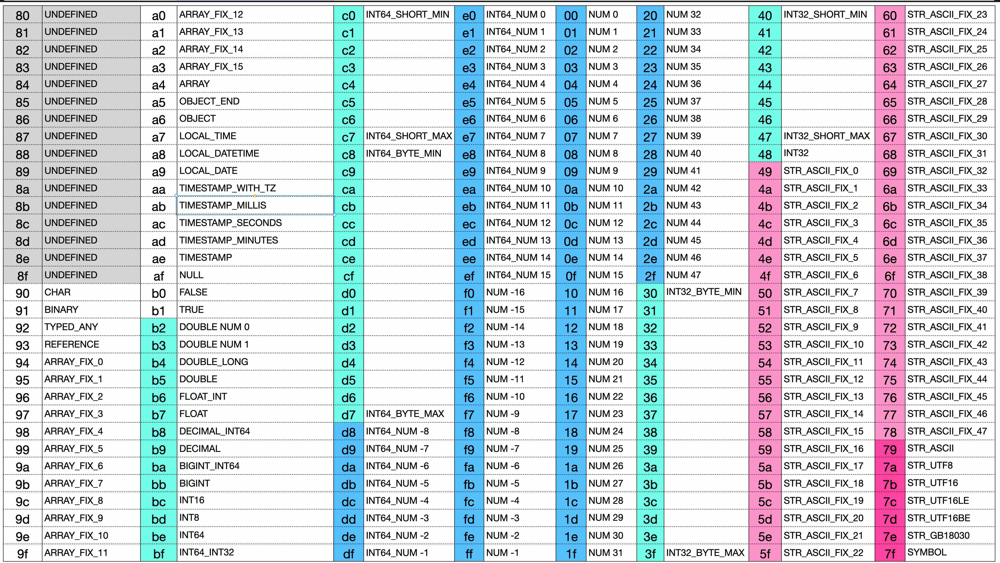

Design of JSONB Storage Format

# 1. Design Goals
1. To be compatible with the JSON format and capable of fully representing JSON.
2. Compact, with no data gaps.
3. Compact design for commonly used integers from -16 to 63.
4. Compact design for null/true/false.
5. Compact design for ARRAYs of length 0 to 15.
6. Compact design for ASCII-encoded strings of length 0 to 47.
7. Support for short encoding of OBJECT names (keys).
8. Support for complete Java serialization and deserialization.

# 2. JSON Support Format Definition



```
x90          # char
x91          # binary len_int32 bytes
x92          # type [str] symbol_int32 jsonb
x93          # reference

x94 - xa3    # array_0 - array_15
xa4          # array len_int32 item*

xa5          # object_end
xa6          # object_start

xa7          # local time b0 b1 b2
xa8          # local datetime b0 b1 b2 b3 b4 b5 b6
xa9          # local date b0 b1 b2 b3
xab          # timestamp millis b0 b1 b2 b3 b4 b5 b6 b7
xac          # timestamp seconds b0 b1 b2 b3
xad          # timestamp minutes b0 b1 b2 b3
xae          # timestamp b0 b1 b2 b3 b4 b5 b6 b7 nano_int32

xaf          # null
xb0          # boolean false
xb1          # boolean true
xb2          # double 0
xb3          # double 1
xb4          # double_long
xb5          # double
xb6          # float_int
xb7          # float
xb8          # decimal_long
xb9          # decimal
xba          # bigint_long
xbb          # bigint
xbc          # short
xbd          # byte
xbe          # long
xbf          # long encoded as 32-bit int ('Y')
xc0 - xc7    # three-octet compact long (-x40000 to x3ffff)
xc8 - xd7    # two-octet compact long (-x800 to x7ff, xd0 is 0)
xd8 - xef    # one-octet compact long (-x8 to xf, xe0 is 0)

xf0 - xff    # one-octet compact int
x00 - x2f    # one-octet compact int

x30 - x3f    # two-octet compact int (-x800 to x7ff)
x40 - x47    # three-octet compact int (-x40000 to x3ffff)
x48          # 32-bit signed integer ('I')

x49 - x78    # ascii string length 0-47
x79          # ascii-8 variable-length
x7a          # utf-8 variable-length
x7b          # utf-16 variable-length
x7c          # utf-16LE variable-length
x7d          # utf-16BE variable-length
x7e          # gb18030 variable-length
x7f          # symbol
```

# 3. Numeric Representation Design
JSONB supports the following numeric types:
* INT8
* INT16
* INT32
* INT64
* BIGINT
* DECIMAL
* FLOAT
* DOUBLE

The representation of numeric values is in a contiguous range from 0xb2 to 0x48.

## 3.1 INT32 Design
The number of bytes required to represent an INT32 varies depending on its value range.

| Value Range                | Bytes Required |
|----------------------------|----------------|
| -16 ~ 47                   | 1              |
| -2048 ~ 2047               | 2              |
| -262144 ~ 262143           | 3              |
| -2147483648 ~ 2147483647   | 5              |
```java
* 0xf0 ~ 0x2f: Directly represents INT32 integers from -16 to 47, requiring only 1 byte without extra conversion.
* 0x30 ~ 0x3f: Represents INT32 integers from -2048 to 2047, requiring 2 bytes.
* 0x40 ~ 0x47: Represents INT32 integers from -262144 to 262143, requiring 3 bytes.
* 0x48 + <4_bytes>: The first byte is 0x48, followed by 4 bytes representing the value, requiring 5 bytes in total.
```

## 3.2 INT64 Design

| Value Range                               | Bytes Required |
|-------------------------------------------|----------------|
| -8 ~ 15                                   | 1              |
| -2048 ~ 2047                              | 2              |
| -262144 ~ 262143                          | 3              |
| -2147483648 ~ 2147483647                  | 5              |
| 0x8000000000000000L ~ 0x7fffffffffffffffL | 9              |
```java
* 0xd8 ~ 0xef: Directly represents INT64 integers from -8 to 15, requiring only 1 byte.
* 0xc8 ~ 0xd7: Represents INT64 integers from -2048 to 2047, requiring 2 bytes.
* 0xc0 ~ 0xc7: Represents INT64 integers from -262144 to 262143, requiring 3 bytes.
* 0xbf + <4_bytes>: The first byte is 0xbf, followed by 4 bytes representing the value, requiring 5 bytes in total.
* 0xbe + <8_bytes>: The first byte is 0xbe, followed by 8 bytes representing the value, requiring 9 bytes in total.
```

## 3.3 INT8 & INT16
```java
* 0xbd + <1_byte>: Represents INT8, requires 2 bytes.
* 0xbc + <2_bytes>: Represents INT16, requires 3 bytes.
```

## 3.4 BIGINT Representation Design
BIGINT has two representations:
```java
* 0xba + <int64>: When the BIGINT's value is within the range 0x8000000000000000L ~ 0x7fffffffffffffffL, it is prefixed with a 0xba byte, requiring 2 to 10 bytes.
* 0xbb + <bytes_len> + <bytes>
```

## 3.5 DECIMAL Representation
DECIMAL has two representations:
```java
* 0xb8 + <int64>: When there is no fractional part and the value is within the range 0x8000000000000000L ~ 0x7fffffffffffffffL, it is prefixed with a 0xb8 byte, requiring 2 to 10 bytes.
* 0xb9 + <scale_int32> + <int32|int64|bigint>
```

## 3.6 FLOAT Representation
FLOAT has two representations:
```java
* 0xb6 + <int32>: Represents a FLOAT without a fractional part, requiring 2 to 6 bytes.
* 0xb7 + <4_bytes>: Requires 5 bytes.
```

## 3.7 DOUBLE Representation
DOUBLE has three representations:
```java
* 0xb2 ~ 0xb3: Represents 0 and 1, occupying 1 byte.
* 0xb4 + <int64>: Represents a double without a fractional part, requiring 2 to 10 bytes.
* 0xb5 + <8_bytes>: Requires 9 bytes.
```


# 4. NULL/TRUE/FALSE
NULL/TRUE/FALSE are each represented by a single byte:
* 0xaf NULL
* 0xb0 FALSE
* 0xb1 TRUE

# 5. String Representation
There are several ways to represent strings:
```java
* 0x49 ~ 0x78: Represents a LATIN1 string with a length of 0 to 47.
* 0x79 + <int32_bytes_len> + <bytes>: LATIN1 string.
* 0x7a + <int32_bytes_len> + <bytes>: UTF8 string.
* 0x7b + <int32_bytes_len> + <bytes>: UTF16 string.
* 0x7c + <int32_bytes_len> + <bytes>: UTF16LE string.
* 0x7d + <int32_bytes_len> + <bytes>: UTF16BE string.
* 0x7e + <int32_bytes_len> + <bytes>: GB18030 encoded string (this can reduce the length for Chinese characters).
* 0x7f + <int32_symbol>: If the symbol is negative, it is an index into the SymbolTable. If it is >= 0, it is a string symbol within the current data.
```
The string format is specifically designed to support LATIN1 encoded characters. This will be very helpful for improving string deserialization performance and will also benefit string serialization in Java 9+.

# 6. Date Representation
```java
* 0xae + <int64_epoch_second> + <int32_nano>: TIMESTAMP, requires 3 to 15 bytes, corresponds to Java's Instant type.
* 0xad + <4_bytes_epoch_minutes>: TIMESTAMP_MINUTES, requires 5 bytes, corresponds to Java's Date type.
* 0xac + <4_bytes_epoch_seconds>: TIMESTAMP_SECONDS, requires 5 bytes, corresponds to Java's Date type.
* 0xab + <8_bytes_epoch_millis>: TIMESTAMP_MILLIS, requires 9 bytes, corresponds to Java's Date type.
* 0xaa + <2_bytes_year> + <1_byte_monthValue> + <1_byte_dayOfMonth> + <1_byte_hour> + <1_byte_minute> + <1_byte_second> + <int32_nano> + <str_zoneId>: Corresponds to Java's ZonedDateTime.
* 0xa9 + <2_bytes_year> + <1_byte_monthValue> + <1_byte_dayOfMonth>: Requires 5 bytes, corresponds to Java's LocalDate type.
* 0xa8 + <2_bytes_year> + <1_byte_monthValue> + <1_byte_dayOfMonth> + <1_byte_hour> + <1_byte_minute> + <1_byte_second> + <int32_nano>: Requires 8 to 12 bytes, corresponds to Java's LocalDateTime type.
* 0xa7 + <1_byte_hour> + <1_byte_minute> + <1_byte_second> + <int32_nano>: Requires 4 to 8 bytes, corresponds to Java's LocalTime type.
```

# 7. Object Type
An object type starts with 0xa6 and ends with 0xa5, containing any number of key-value pairs in between, as follows:
```java
0xa6
    [<key_any> <value_any>]...
0xa5
```

# 8. Array Type
An array has two representations:
```java
* 0x94 ~ 0xa3: Represents an array with 0 to 15 elements.
* 0xa4 + <int32_length> + <item...>
```

# 9. Reference
```java
* 0x93 + <str_reference_path>
```

# 10. Typed_Any
This type enables complete serialization and deserialization.
```java
* 0x92 + <str_typename> + <any>
```

# 11. Binary Type
```java
0x91 + <int32_length> + <bytes>
```

# 12. char type
```
0x90 <byte1>
```
