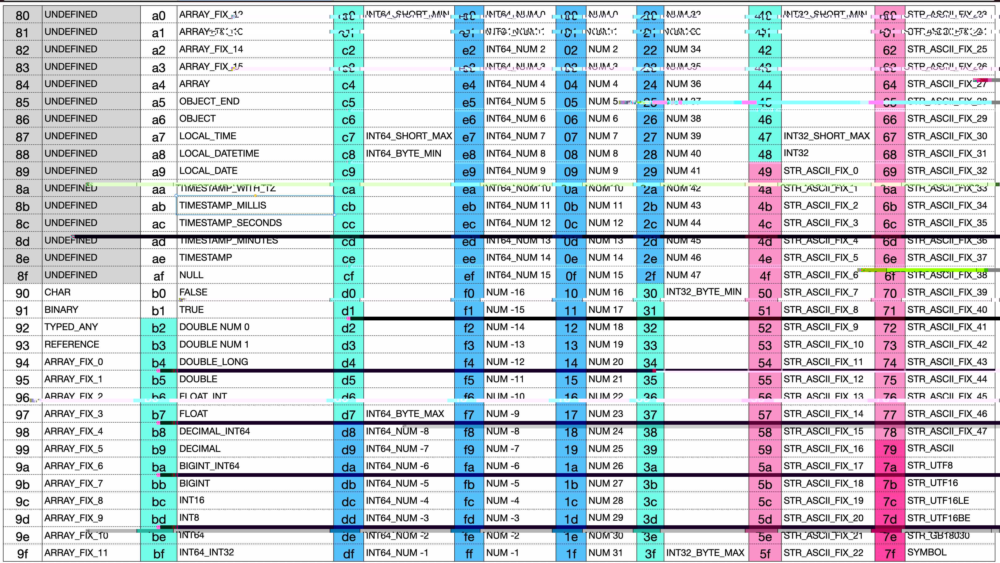

JSONB存储格式设计

# 1. 设计目标
1. 和JSON格式对应，能完全表示JSON
2. 紧凑，数据不留空洞
3. 对常用整数-16~63做紧凑设计
4. 对null/true/false做紧凑设计
5. 对0~15长度的ARRAY 做紧凑设计
6. 对0~47长度的ascii编码的字符串做紧凑设计
7. 对OBJECT类型的Name做短编码的支持
8. 支持完整的Java序列化和反序列化

# 2. JSON支持格式定义



```
x90          # char
x91          # bianry len_int32 bytes
x92          # type [str] symbol_int32 jsonb
x93          # reference

x94 - xa3    # array_0 - array_15
xa4          # array len_int32 item*

xa5          # object_end
xa6          # object_start

xa7          # local time b0 b1 b2
xa8          # local datetime b0 b1 b2 b3 b4 b5 b6
xa9          # local date b0 b1 b2 b3
xab          # timestamp millis b0 b1 b2 b3 b4 b5 b6 b7
xac          # timestamp seconds b0 b1 b2 b3
xad          # timestamp minutes b0 b1 b2 b3
xae          # timestamp b0 b1 b2 b3 b4 b5 b6 b7 nano_int32

xaf          # null
xb0          # boolean false
xb1          # boolean true
xb2          # double 0
xb3          # double 1
xb4          # double_long
xb5          # double
xb6          # float_int
xb7          # float
xb8          # decimal_long
xb9          # decimal
xba          # bigint_long
xbb          # bigint
xbc          # short
xbd          # byte
xbe          # long
xbf          # long encoded as 32-bit int ('Y')
xc0 - xc7    # three-octet compact long (-x40000 to x3ffff)
xc8 - xd7    # two-octet compact long (-x800 to x7ff, xd0 is 0)
xd8 - xef    # one-octet compact long (-x8 to xf, xe0 is 0)

xf0 - xff    # one-octet compact int
x00 - x2f    # one-octet compact int

x30 - x3f    # two-octet compact int (-x800 to x7ff)
x40 - x47    # three-octet compact int (-x40000 to x3ffff)
x48          # 32-bit signed integer ('I')

x49 - x78    # ascii string length 0-47
x79          # ascii-8 variable-length
x7a          # utf-8 variable-length
x7b          # utf-16 variable-length
x7c          # utf-16LE variable-length
x7d          # utf-16BE variable-length
x7e          # gb18030 variable-length
x7f          # symbol
```

# 3. 数值表示设计
jsonb支持的数值类型：
* INT8
* INT16
* INT32
* INT64
* BIGINT
* DECIMAL
* FLOAT
* DOUBLE

数值的表示在连续的区间，范围是0xb2 ~ 0x48

## 3.1 INT32设计
INT32的表示在不同取值范围所需要的字节数不一样

| 取值范围                     | 所需要字节数 |
|--------------------------|--------|
| -16 ~ 47                 | 1      |
| -2048 ~ 2047             | 2      |
| -262144 ~ 262143         | 3      | 
| -2147483648 ~ 2147483647 | 5      |
```java
* 0xf0 ~ 0x2f 直接表示-16 ~ 47的INT32整数，只需要1个字节，也不需要额外转换
* 0x30 ~ 0x3f 表示-2048 ~ 2047的INT32整数，需要使用2个字节
* 0x40 ~ 0x47 表示-262144 ~ 262143的，需要使用3个字节
* 0x48 + <bytes4>，第1个byte是0x48，之后4个byte表示数值，需要使用5个字节
```

## 3.2 INT64设计

| 取值范围                                      | 所需要字节数 |
|-------------------------------------------|--------|
| -8 ~ 15                                   | 1      |
| -2048 ~ 2047                              | 2      |
| -262144 ~ 262143                          | 3      | 
| -2147483648 ~ 2147483647                  | 5      |
| 0x8000000000000000L ~ 0x7fffffffffffffffL | 9      |
```java
* 0xd8 ~ 0xef 直接表示-8 ~ 15的INT64整数，只需要1个字节
* 0xc8 ~ 0xd7 表示-2048 ~ 2047的INT64整数，需要使用2个字节
* 0xc0 ~ 0xc7 表示-262144 ~ 262143的INT64整数，需要使用3个字节
* 0xbf + <bytes4>，第1个byte是0xbf，之后4个byte表示数值，需要使用5个字节
* 0xbe + <bytes8>，第1个byte是0xbe，之后8个byte表示数值，需要使用9个字节
```

## 3.3 INT8 & INT16
```java
* 0xbd + <bytes1> 表示IN8，需要2个字节
* 0xbc + <bytes2> 表示IN16，需要3个字节
```

## 3.4 BIGINT表示设计
BIGINT有两种表示法：
```java
* 0xba + <int64> ，当BIGINT的取值范围在0x8000000000000000L ~ 0x7fffffffffffffffL时，在int64之前加一个0xba的字节，所需要的字节数是2 ~ 10。
* 0xbb + <bytes_len> + <bytes>
```

## 3.5 DECIMAL表示法
DECIMAL有两种表示法
```java
* 0xb8 + <int64>，当没有小数，并且 取值范围在0x8000000000000000L ~ 0x7fffffffffffffffL时，在int64之前加一个0xb8的字节，所需要的字节数是2 ~ 10。
* 0xb9 + <scale_int32> + <int32|int64|bigint>
```

## 3.6 FLOAT表示
FLOAT有两种表示法
```java
* 0xb6 + <int32> 没有小数的FLOAT，所需要字节数2 ~ 6个
* 0xb7 + <bytes4> 需要5个字节
```


## 3.7 DOUBLE表示
DOUBLE有三种表示
```java
* 0xb2 ~ 0xb3 表示0和1，占1个字节
* 0xb4 + <int64> 没有小数的double，所需要2~10个字节
* 0xb5 + <bytes8> 需要9个bytes
```


# 4. NULL/TRUE/FALSE
NULL/TRUE/FALSE都使用1个字节表示
* 0xaf NULL
* 0xb0 FALSE
* 0xb1 TRUE

# 5. 字符串表示
字符串的表示有三种办法：
```java
* 0x49 ~ 0x78 表示长度为0 ~ 47的LATIN1字符串
* 0x79 + <int32_bytes_len> + <bytes> LATIN1字符串
* 0x7a + <int32_bytes_len> + <bytes> UTF8字符串
* 0x7b + <int32_bytes_len> + <bytes> UTF16字符串
* 0x7c + <int32_bytes_len> + <bytes> UTF16LE字符串
* 0x7d + <int32_bytes_len> + <bytes> UTF16BE字符串
* 0x7e + <int32_bytes_len> + <bytes> GB18030编码字符串（这个可以减少中文编码的长度）
* 0x7f + <int32_symbol> 如果symbol为负数，则是SymbolTable中的下标。如果是>=0，则是当前数据中字符串符号
```

# 6. 日期表示
```java
* 0xae + <int64_epoch_second> + <int32_nano> TIMESTAMP 需要3~15个字节，对应java中的Instant类型
* 0xad + <bytes4_epoch_minutes> TIMESTAMP_MINUTES 需要5个字节，对应java中的Date类型
* 0xac + <bytes4_epoch_seconds> TIMESTAMP_SECONDS 需要5个字节，对应java中的Date类型
* 0xab + <bytes8_epoch_millis> TIMESTAMP_MILLIS 需要9个字节，对应java中的Date类型
* 0xaa + <bytes2_year> + <bytes1_monthValue> + <bytes1_dayOfMonth> + <bytes1_hour> + <bytes1_minute> + <bytes1_second> + <int32_nano> + <str_zoneId>，对应java中ZonedDateTime
* 0xa9 + <bytes2_year> + <bytes1_monthValue> + <bytes1_dayOfMonth> 需要5个字节，对应java中的LocalDate类型
* 0xa8 + <bytes2_year> + <bytes1_monthValue> + <bytes1_dayOfMonth> + <bytes1_hour> + <bytes1_minute> + <bytes1_second> + <int32_nano> 需要8~12个字符，对应java中的LocalDateTime类型
* 0xa7 + <bytes1_hour> + <bytes1_minute> + <bytes1_second> + <int32_nano> 需要4~8个字符，对应java中的LocalTime类型

```

# 7. 对象类型
对象类型以0xa6开始，0xa5结束，中间有若干个key_value对，如下：
```java
0xa6
    [<key_any> <value_anry>]...
0xa5
```

# 8. 数组类型
数组有两种表示法
```java
* 0x94 ~ 0xa3表示元素个数为0~15的数组
* 0xa4 + <int32_length> + <item...>
```

# 9. Reference
```java
* 0x93 + <str_reference_path>
```

# 10. Typed_Any
这个类型可以使得支持完整地序列化和反序列化
```java
* 0x92 + <str_typename> + <any>
```

# 11. 二进制类型
```java
0x91 + <int32_length> + <bytes>
```

# 12. char类型
```
0x90 <byte1>
```
