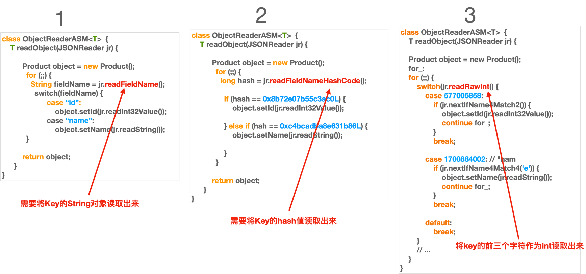

# 反序列化字段匹配算法介绍
fastjson2使用字段名hash和字段名前缀字节匹配来优化反序列化性能。本仓库是基于fastjson2 2.0.63裁剪的版本，仅保留core模块，编译期的Annotation Process Tools(APT)代码生成模块不属于本仓库，反序列化代码不在编译期生成。

## 1. 字段匹配算法介绍



上图中算法1是常规实现；算法2是fastjson2的实现（最初是dsljson引入，被fastjson借鉴）；算法3是新引入的实现

我们要将json反序列化为如下的Image类
```java
@Data
public class Image {
    private int height;
    private Size size;
    private String title;
    private String uri;
    private int width;
}
```

fastjson2在匹配字段名时，不需要将整个key读取出来做字符串比较。JSONReader提供了`readFieldNameHashCode()`计算字段名hash，JSONReaderUTF8还提供了基于字段名前缀字节的快速匹配方法`nextIfName4Match*`，把key的前几个字节当作一个int值来比较。基于这些原语的字段分发表意如下：
```java
public final class Image_FASTJSONReader {
    public Object readObject(
            com.alibaba.fastjson2.JSONReader jsonReader,
            java.lang.reflect.Type fieldType,
            Object fieldName,
            long features
    ) {
        Image object = new Image();

        while (!jsonReader.nextIfObjectEnd()) {
            switch (jsonReader.getRawInt()) {
                // '"' | ('w' << 8) | ('i' << 16) | ('d' << 24) == 1684633378
                // 't' | ('h' << 8) | ('"' << 16) | (':' << 24) == 975333492
                case 1684633378: // "wid
                    if (jsonReader.nextIfName4Match5(975333492)) { // th":
                        object.setWidth(
                                jsonReader.readInt32Value()
                        );
                        continue;
                    }
                    break;
                // '"' | ('h' << 8) | ('e' << 16) | ('i' << 24) == 1768253474
                // 'g' | ('h' << 8) | ('t' << 16) | ('"' << 24) == 578054247
                case 1768253474: // "hei
                    if (jsonReader.nextIfName4Match6(578054247)) { // ght"
                        object.setHeight(
                                jsonReader.readInt32Value()
                        );
                        continue;
                    }
                    break;
               // '"' | ('u' << 8) | ('r' << 16) | ('i' << 24) == 1769108770
                case 1769108770: // "uri"
                    if (jsonReader.nextIfName4Match3()) {
                        object.setUri(
                                jsonReader.readString()
                        );
                        continue;
                    }
                    break;
                // ...
                default:
                    break;
            }
            // ....
        }
        return object;
    }
}
```

相关方法在JSONReader中的实现
```java
class JSONReaderUTF8 extends JSONReader {
    public final int getRawInt() {
        if (offset + 3 < bytes.length) {
            return UNSAFE.getInt(bytes, ARRAY_BYTE_BASE_OFFSET + offset - 1);
        }
        return 0;
    }

    public boolean nextIfName4Match3() {
        offset += 5;

        if (bytes[offset - 2] != '"' || bytes[offset - 1] != ':') {
            return false;
        }

        // ...

        return true;
    }

    public final boolean nextIfName4Match4(byte c4) {
        offset += 6;
        if (bytes[offset - 3] != c4 || bytes[offset - 2] != '"' || bytes[offset - 1] != ':') {
            return false;
        }
        // ...
        return true;
    }
    
    public boolean nextIfName4Match5(int name1) {
        offset += 7;
        if (UNSAFE.getInt(bytes, ARRAY_BYTE_BASE_OFFSET + offset - 4) != name1) {
            return false;
        }
        // ...
        return true;
    }
    
    public boolean nextIfName4Match6(int name1) {
        offset += 8;
        if (UNSAFE.getInt(bytes, ARRAY_BYTE_BASE_OFFSET + offset - 5) != name1 || bytes[offset - 1] != ':') {
            return false;
        }
        // ...
        return true;
    }
}
```

这样的实现好处是，不需要将key读取出来做字符串比较，而是通过key的前缀字节读取一个int值，使用switch来路由到相应字段的处理。

## 2. 实现说明
* 字段hash匹配：`JSONReader#readFieldNameHashCode`、`JSONReaderUTF8#getRawInt`、`JSONReaderUTF8#nextIfName4Match*`
* ObjectReader创建：`com.alibaba.fastjson2.reader.ObjectReaderCreator`，基于反射和LambdaMetafactory生成字段访问器
* 内置ASM（`com.alibaba.fastjson2.internal.asm`，裁剪版ASM 9.2）用于构造器参数名读取：`ASMUtils#lookupParameterNames`
* 编译期APT代码生成（codegen模块）不属于本仓库，`@JSONCompiler`、`@JSONCompiled`注解仅保留文件，不会在编译期生成反序列化代码
