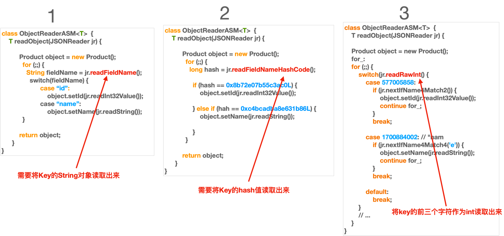

# Introduction to the Deserialization CodeGen Algorithm
fastjson2 uses codegen to optimize deserialization performance. The codegen techniques used include:
*   ASM: Dynamic bytecode class generation based on a built-in, trimmed version of ASM 9.2.
*   Annotation Processing Tools (APT)

## 1. Introduction to the Implementation Algorithm



In the diagram above, Algorithm 1 is a conventional implementation; Algorithm 2 is fastjson2's implementation (originally introduced by dsljson and adopted by fastjson); Algorithm 3 is a newly introduced implementation.

We want to deserialize a JSON into the following `Image` class:
```java
@Data
public class Image {
    private int height;
    private Size size;
    private String title;
    private String uri;
    private int width;
}
```

The following code is generated to quickly associate the names in the JSON with the fields:
```java
public final class Image_FASTJSONReader
    extends com.alibaba.fastjson2.reader.ObjectReader5 {

    public Object readObject(
            com.alibaba.fastjson2.JSONReader jsonReader,
            java.lang.reflect.Type fieldType,
            Object fieldName,
            long features
    ) {
        Image object = new Image();

        while (!jsonReader.nextIfObjectEnd()) {
            switch (jsonReader.getRawInt()) {
                // '"' | ('w' << 8) | ('i' << 16) | ('d' << 24) == 1684633378
                // 't' | ('h' << 8) | ('"' << 16) | (':' << 24) == 975333492
                case 1684633378: // "wid
                    if (jsonReader.nextIfName4Match5(975333492)) { // th":
                        object.setWidth(
                                jsonReader.readInt32Value()
                        );
                        continue;
                    }
                    break;
                // '"' | ('h' << 8) | ('e' << 16) | ('i' << 24) == 1768253474
                // 'g' | ('h' << 8) | ('t' << 16) | ('"' << 24) == 578054247
                case 1768253474: // "hei
                    if (jsonReader.nextIfName4Match6(578054247)) { // ght"
                        object.setHeight(
                                jsonReader.readInt32Value()
                        );
                        continue;
                    }
                    break;
               // '"' | ('u' << 8) | ('r' << 16) | ('i' << 24) == 1769108770
                case 1769108770: // "uri"
                    if (jsonReader.nextIfName4Match3()) {
                        object.setUri(
                                jsonReader.readString()
                        );
                        continue;
                    }
                    break;
                // ...
                default:
                    break;
            }
            // ....
        }
        return object;
    }
}
```

The implementation of the related methods in `JSONReader` is as follows:
```java
class JSONReaderUTF8 implements JSONReader {
    public final int getRawInt() {
        if (offset + 3 < bytes.length) {
            return UNSAFE.getInt(bytes, ARRAY_BYTE_BASE_OFFSET + offset - 1);
        }
        return 0;
    }

    public boolean nextIfName4Match3() {
        offset += 5;

        if (bytes[offset - 2] != '"' || bytes[offset - 1] != ':') {
            return false;
        }

        // ...

        return true;
    }

    public final boolean nextIfName4Match4(byte c4) {
        offset += 6;
        if (bytes[offset - 3] != c4 || bytes[offset - 2] != '"' || bytes[offset - 1] != ':') {
            return false;
        }
        // ...
        return true;
    }
    
    public boolean nextIfName4Match5(int name1) {
        offset += 7;
        if (UNSAFE.getInt(bytes, ARRAY_BYTE_BASE_OFFSET + offset - 4) != name1) {
            return false;
        }
        // ...
        return true;
    }
    
    public boolean nextIfName4Match6(int name1) {
        offset += 8;
        if (UNSAFE.getInt(bytes, ARRAY_BYTE_BASE_OFFSET + offset - 5) != name1 || bytes[offset - 1] != ':') {
            return false;
        }
        // ...
        return true;
    }
}
```

The advantage of this implementation is that it doesn't need to read the entire key, nor does it need to use `JSONReader#readFieldNameHashCode`. Instead, it reads an integer value from the first few bytes of the key and uses a `switch` statement to route to the corresponding field's processing logic.

## 2. Algorithm Implementation Code
Code Generation Implementation:
*   ASM Implementation: `com.alibaba.fastjson2.reader.ObjectReaderCreatorASM#genRead243`
*   APT Implementation: `com.alibaba.fastjson2.internal.processor.JSONCompiledAnnotationProcessor.genRead243`
